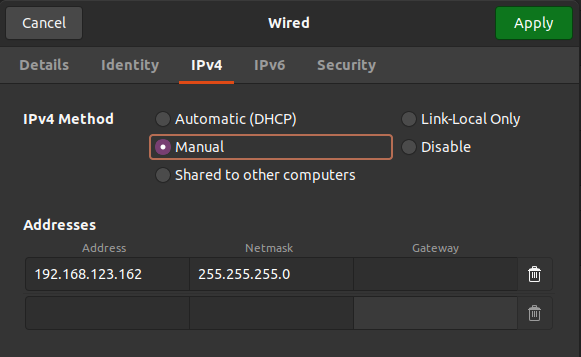

# Real Robot control

## Setup
- make sure `z1_ctrl` program is turned off before turn on the manipulator
- turn on the robotic arm, when the device is powered on successfully,
the green light is steady on, and the blue light will flash once the self-check passes. Make sure the robot is in the home position (all the joints in zero)
- connect the arm to the PC through an ethernet cable 
- setup the network configuration through the UI (this should be sufficient only one time), Settings -> Network -> Wired and then set manually the IPv4 as in the foollowing image 

  

- the dafault IP address of the robotics arm is **192.168.123.110**, make sure to ping it when the wired connection is established 

## Experiment
- open two terminals 
    1. run the program `z1_ctrl` (rember to build the soruce code if not been done)
        ```
        cd unitree_ws/src/z1_controller/build
        ./z1_ctrl
        ```
    2. on the other terminal, run one of the programs (either from c++ or pyhton) inside the SDK, for example run `highcmd_development`:
        ```
        cd unitree_ws/src/z1_sdk/build
        ./highcmd_development
        ```
- NOTE: each experiment can be interrupted by pressing `ctrl + C` in the terminal of the SDK. Remeber that the interruption bring the robot in the passive mode, so it will fall down. 